# 学习使用Typora

[TOC]

## 块级元素

### 段落与换行符

使用 `#`来控制多级标题

```markdown
# 这是一级标题
## 这是二级标题
###### 这是六级标题
```

### 块引用

使用`>`开设置块引用

```markdown
> 这是第一段引用
> 
> 这是第二段引用

> 这是新段引用
```

### 列表

使用`*` 或 `+` 或 `-` 创建无序列表， 使用`数字`来创建有序列表

```markdown
## 无序列表
* red
* green
* blue

## 有序列表
1. Red
2. Green
3. Blue
```

### 任务列表

使用 `[ ]`来表示这行是一个任务，多个任务是一个无序列表

```markdown
- [ ] 任务1
- [x] 任务2
- [ ] 任务3
```

### 代码块

使用\``` 加 语言语法 + 代码 + \``` 来设置

~~~gfm
``` js
function test(){
	console.log("test");
}
```
~~~

### 公式块

使用 `$$` + `Enter`开启一个公式块的开头
$$
\mathbf{V}_1 \times \mathbf{V}_2 = \begin{vmatrix}
\mathbf{i} & \mathbf{j} & \mathbf{k} \\
\frac{\partial X}{\partial u} & \frac{\partial Y}{\partial u} & 0 \\
\frac{\partial X}{\partial v} & \frac{\partial Y}{\partial v} & 0
\end{vmatrix}
$$
<font color="green">公式的latex源码是这样的</font>

```markdown
$$
\mathbf{V}_1 \times \mathbf{V}_2 = \begin{vmatrix}
\mathbf{i} & \mathbf{j} & \mathbf{k} \\
\frac{\partial X}{\partial u} & \frac{\partial Y}{\partial u} & 0 \\
\frac{\partial X}{\partial v} & \frac{\partial Y}{\partial v} & 0
\end{vmatrix}
$$
```


$$
\begin{align*}
y = y(x,t) &= A e^{i\theta} \\
&= A (\cos \theta + i \sin \theta) \\
&= A (\cos(kx - \omega t) + i \sin(kx - \omega t)) \\
&= A\cos(kx - \omega t) + i A\sin(kx - \omega t) \\
&= A\cos \Big(\frac{2\pi}{\lambda}x - \frac{2\pi v}{\lambda} t) \\
&= A\cos \frac{2\pi}{\lambda}(x - vt) + i A\sin \frac{2\pi}{\lambda}(x - vt)
\end{align*}
$$
$\color{green}公式的latex源码是这样的$

```markdown
$$
\begin{align*}
y = y(x,t) &= A e^{i\theta} \\
&= A (\cos \theta + i \sin \theta) \\
&= A (\cos(kx - \omega t) + i \sin(kx - \omega t)) \\
&= A\cos(kx - \omega t) + i A\sin(kx - \omega t) \\
&= A\cos \Big(\frac{2\pi}{\lambda}x - \frac{2\pi v}{\lambda} t) \\
&= A\cos \frac{2\pi}{\lambda}(x - vt) + i A\sin \frac{2\pi}{\lambda}(x - vt)
\end{align*}
$$
```

### 内联公式

使用`$`开头与 `$` 结尾中间的就是公式源码，必须要设置typora中的markdown配置，打开inline Math

例如:

$f = \frac{2\pi}{T}(x)$

$\ce{CH4 + 2\left( \ce{O2 + 79/21 N2}\right)}$

$\sqrt[3]{10}$

$\overrightarrow{E(\vec{r})}$

$\overline{v}=\bar{v}$

$\underline{v}$
$$
\iint \limits _D \left (\frac{\partial Q}{\partial x} - \frac{\partial P}{\partial y}\right) {\rm d}x{\rm d}y = \oint \limits _L P{\rm d}x + Q{\rm d}y \\

\iint \limits _D \Big (\frac{\partial Q}{\partial x} - \frac{\partial P}{\partial y} \Big ) dxdy = \oint \limits _L Pdx + Qdy\\

\iint \limits _D (\frac{\partial Q}{\partial x} - \frac{\partial P}{\partial y}) dxdy = \oint \limits _L Pdx + Qdy \\

\lim \limits _{n\to\infin}(1 + \frac{1}{n})^n = e \\

\sum _{i=1}^n\frac{1}{n^2} \quad and \quad \prod _{i=1}^n\frac{1}{n^2} \\

\large \sum \quad and \quad \small \sum \\

\bigcup _{i=1}^n\frac{1}{n^2} \quad and \quad \bigcap _{i=1}^n\frac{1}{n^2} \\
$$


### 分割线

使用 `---` 或 `***`来创建一个行分割线


## Span元素

### 超链接

```markdown
[这是一个内联超链接](http://xxxxxxx.xxx "内联链接")
[这个一个内部跳转链接, 跳转到 块级元素 标题](#块级元素)


[home]: #学习使用Typora
...
[这是一个引用链接][home]
也可以直接
[home][]
```

[这是一个内联超链接](http://xxxxxxx.xxx "内联链接")
[这个一个内部跳转链接, 跳转到 块级元素 标题](#块级元素)


### URLs

直接在url两端添加一对 `<>`，如果是标准的url，会自动识别为连接

例如: <jy@163.com>     www.baidu.com

### 图片


### 强调

使用 `*` 或 `_` 来强调，使用两个是着重强调

*abc*, **abc**,

 _abc_, __abc__

### 代码

使用 \`\` 来高亮其中的代码

use the `printf()` function

### 删除线

使用两个`~~` 开始删除位置 ，再`~~`结束

~~这是一个删除的广西~~

### 下划线

使用html标签 `<u>`来标记

<u>这是一个下划线</u>

### Emoji

使用 `:xxx:` 表示

如:  :smile:

### 

## 图表

### 序列

``` sequence
Alice->Bob: Hello Bob, how are you?
note right of Bob: Bob thinks
Bob-->Alice: I am good thanks!
```

$\color{green}源码如下:$

~~~markdown
```sequence
Alice->Bob: Hello Bob, how are you?
note right of Bob: Bob thinks
Bob-->Alice: I am good thanks!
```
~~~

### 流程图

``` flow
st=>start: Start
op=>operation: Your Operation
cond=>condition: Yes or No?
e=>end

st->op->cond->e
cond(yes)->e
cond(no)->op
```

$\color{green} 源码如下:$

~~~markdown
```flow
st=>start: Start
op=>operation: Your Operation
cond=>condition: Yes or No?
e=>end

st->op->cond
cond(yes)->e
cond(no)->op
```
~~~


## Mermaid来做图表

### 制作 sequence

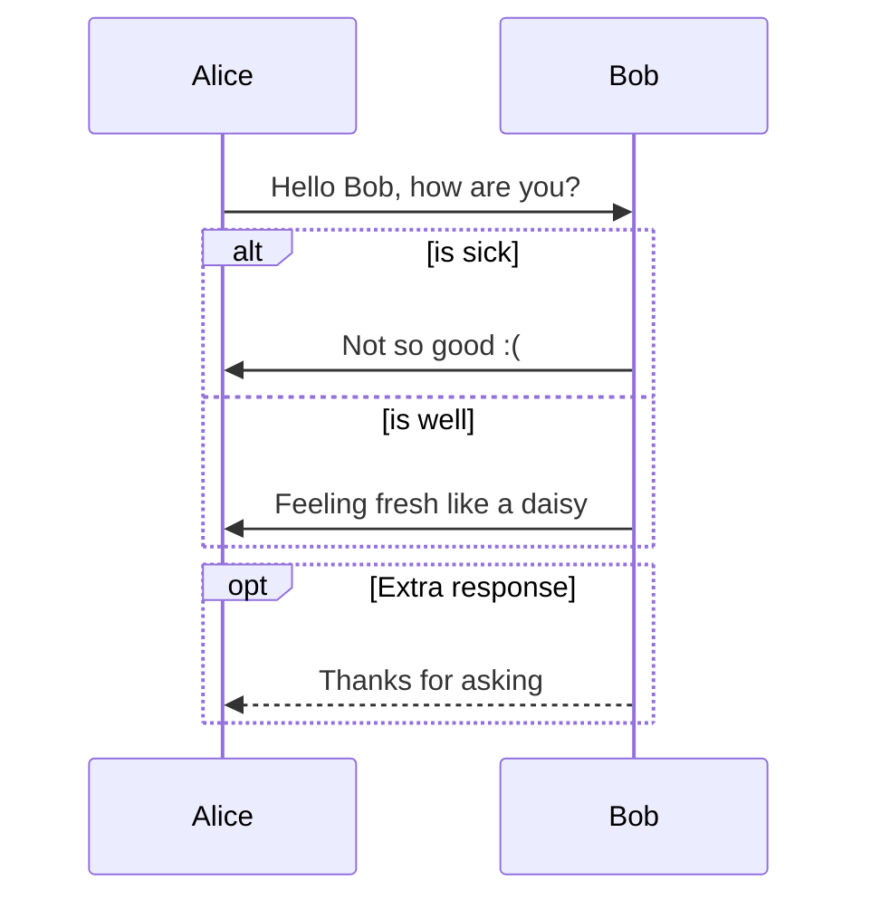


### 制作flow

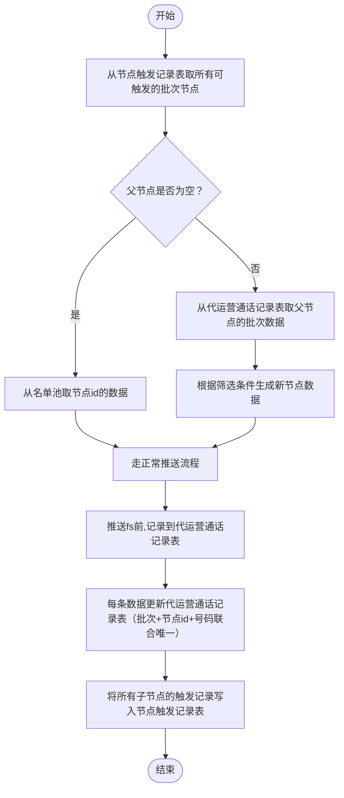

### 制作Gantt

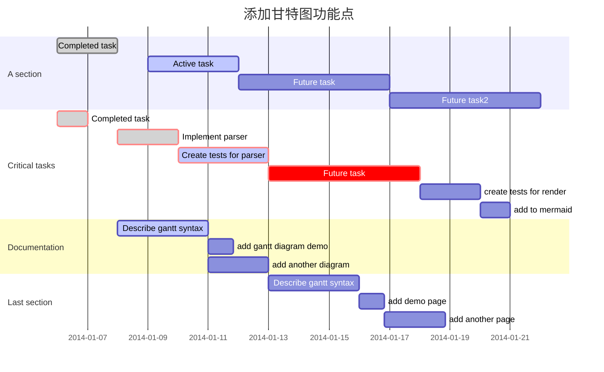

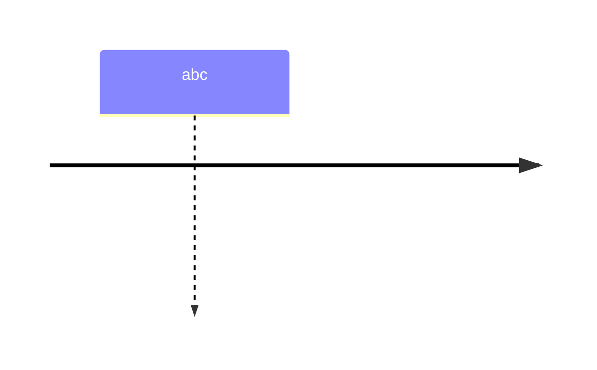


### 类图

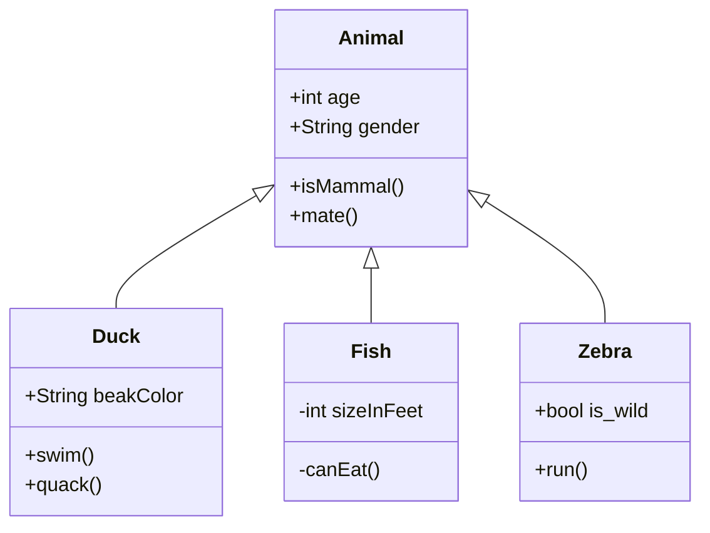

### 状态图

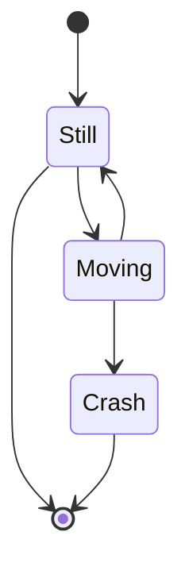

### 饼图

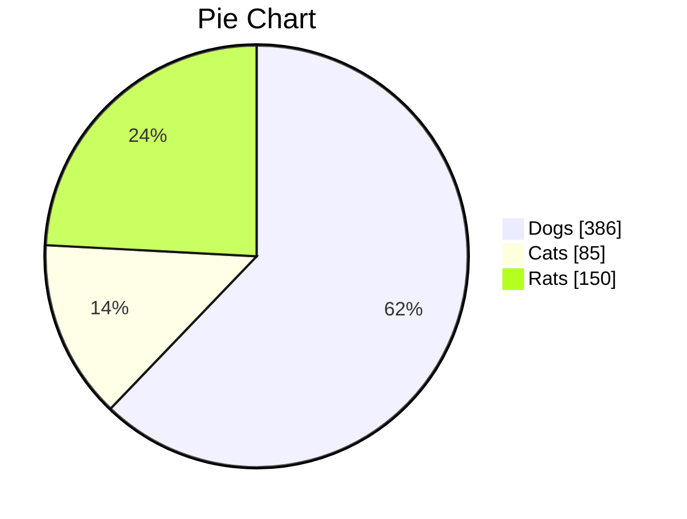

### GitGraph图

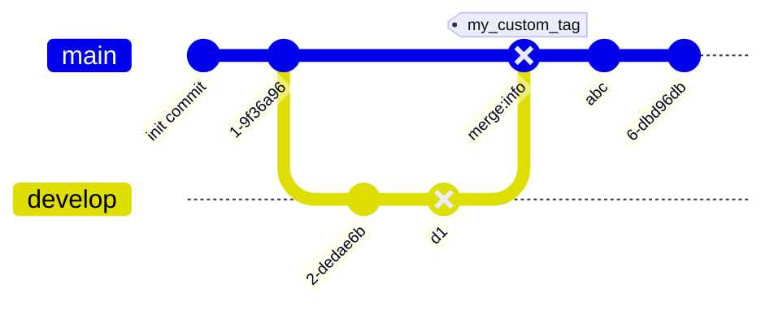

### XYChart表

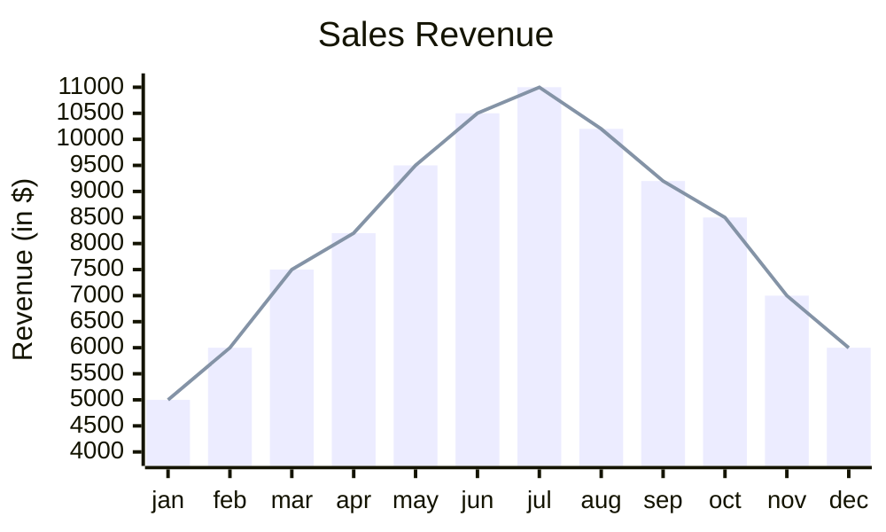


### Block图表

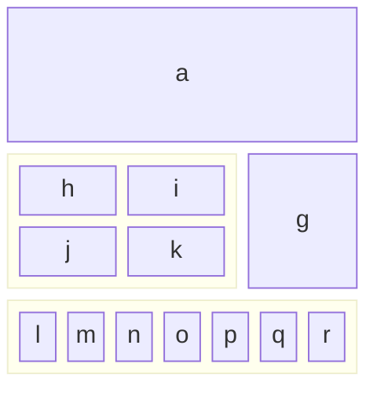

### Network package图

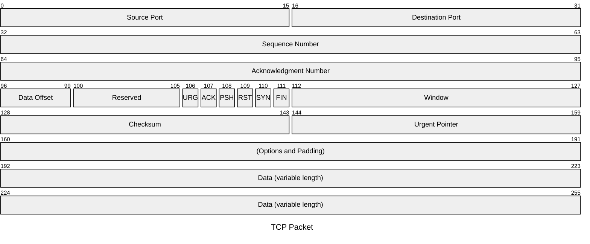

### 架构图

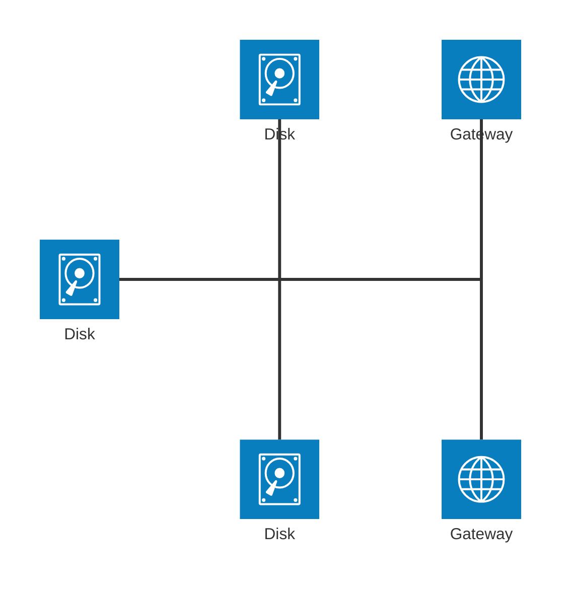


### 第三方插件功能

```echarts
// 提供内置变量:
//   1. myChart: echarts实例
//   2. echarts: echarts模块
//   3. option:  echarts实例的option
//   4. this:    echarts插件实例
// 更多示例：https://echarts.apache.org/examples/zh/index.html#chart-type-line
// 代码块里的所有内容都会被eval，请注意安全问题
// 可以使用如下注释设置图表宽高（否则使用默认）：
// {height: "300px", width: ""}

option = {
    tooltip: { trigger: 'item' },
    legend: { top: '5%', left: 'center' },
    series: [{
        name: 'Access From',
        type: 'pie',
        radius: ['40%', '70%'],
        avoidLabelOverlap: false,
        label: { show: false, position: 'center' },
        emphasis: { label: { show: true,  fontSize: 40,  fontWeight: 'bold' } },
        labelLine: { show: false },
        data: [
            {value: 1548, name: 'Search Engine'},
            {value: 735, name: 'Direct'},
            {value: 580, name: 'Email'},
            {value: 484, name: 'Union Ads'},
            {value: 310, name: 'Video Ads'}
        ]
    }]
}
```

```chart
// 提供内置变量:
//   1. Chart:   chart类
//   2. config:  chart的config
//   3. this:    chart插件实例
// API：https://chart.nodejs.cn/docs/latest/configuration/
// 代码块里的所有内容都会被eval，请注意安全问题
// 可以使用如下注释设置图表宽高（否则使用默认）：
// {height: "300px", width: ""}

config = {
  type: "bar",
  data: {
    labels: ["Red", "Blue", "Yellow", "Green", "Purple", "Orange"],
    datasets: [{
      label: "# of Votes",
      data: [12, 19, 3, 5, 2, 3],
      backgroundColor: [
        "rgba(255, 99, 132, 0.2)", "rgba(54, 162, 235, 0.2)", "rgba(255, 206, 86, 0.2)",
        "rgba(75, 192, 192, 0.2)", "rgba(153, 102, 255, 0.2)", "rgba(255, 159, 64, 0.2)"
      ],
      borderColor: [
        "rgba(255, 99, 132, 1)", "rgba(54, 162, 235, 1)", "rgba(255, 206, 86, 1)",
        "rgba(75, 192, 192, 1)", "rgba(153, 102, 255, 1)", "rgba(255, 159, 64, 1)"
      ],
      borderWidth: 1
    }]
  }
}
```

```abc
X:1
T:Twinkle, Twinkle, Little Star
M:4/4
L:1/4
K:C
G2 G2|A2 A2|B2 B2|c3 z|G2 G2|A2 A2|B2 G2|c3 z||
```

```calendar
// 提供内置变量:
//   1. calendar: calendar实例
//   2. Calendar: Calendar类
//   3. option:   calendar的option
//   4. this:     calendar插件实例
// example：https://nhn.github.io/tui.calendar/latest/tutorial-06-daily-view
// API: https://github.com/nhn/tui.calendar/blob/main/docs/en/apis/options.md
// 代码块里的所有内容都会被eval，请注意安全问题
// 可以使用如下注释设置图表宽高（否则使用默认）：
// {height: "800px", width: ""}

const today = new Date();
const yesterday = new Date(today.getTime() - 24 * 60 * 60 * 1000);
const nextMonth = new Date(today.getFullYear(), today.getMonth() + 1, 1);

option = {defaultView: 'week'};
calendar.createEvents([
    {id: 'event1', calendarId: 'cal2', title: 'meeting', start: yesterday, end: today},
    {id: 'event2', calendarId: 'cal1', title: 'appointment', start: yesterday, end: nextMonth},
]);
```


```wavedrom
// 教程: https://wavedrom.com/tutorial.html
// 代码块里的所有内容都会被eval，请注意安全问题
// 可以使用如下注释设置图表宽高（否则使用默认）：
// {height: "300px", width: ""}
{
    signal: [
        { name: "pclk", wave: 'p.......' },
        { name: "Pclk", wave: 'P.......' },
        { name: "nclk", wave: 'n.......' },
        { name: "Nclk", wave: 'N.......' },
        { name: 'clk0', wave: 'phnlPHNL' },
        {},
        { name: 'clk1', wave: 'xhlhLHl.' },
        { name: 'clk2', wave: 'hpHplnLn' },
        { name: 'clk3', wave: 'nhNhplPl' },
        { name: 'clk4', wave: 'xlh.L.Hx' },
    ],
    config : { "hscale" : 1.4 }
}
```


> [!NOTE]
> Support Type: TIP、BUG、INFO、NOTE、QUOTE、EXAMPLE、CAUTION、FAILURE、WARNING、SUCCESS、QUESTION、ABSTRACT、IMPORTANT

> [!Question] 
>
> 


```kanban
# Today's task

## Todo
- 这是任务1
- 这是任务2

## In-Progress
* 任务3

## Completed
- 任务4

```


```timeline
# 使用一级标题表示timeline的标题

## 2022-10-01
**使用二级标题表示时间**


## 2023-10-01


```


| 列1  | 列2  | 列3  |
| ---- | ---- | ---- |
| abc  | def  | gaf  |
| saf  | ef   | asf  |
| asf  | afe  | asef |

