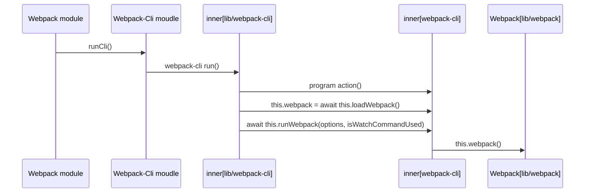
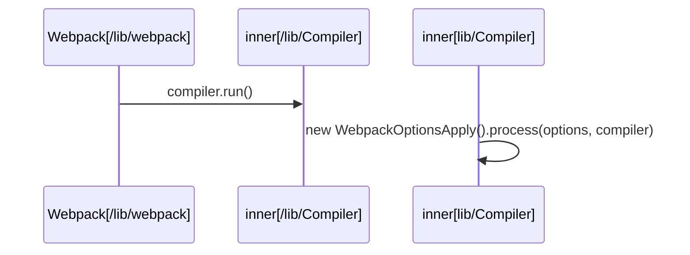

# webpack构建流程

[TOC]

### webpack --config webpack.config.js执行过程

```mermaid
sequenceDiagram
	Webpack module->>Webpack-Cli moudle: runCli()
	Webpack-Cli moudle->>inner[lib/webpack-cli]: webpack-cli run()
	inner[lib/webpack-cli] ->> inner[webpack-cli]: program action()
	inner[lib/webpack-cli] ->> inner[webpack-cli]: this.webpack = await this.loadWebpack()
	inner[lib/webpack-cli] ->> inner[webpack-cli]: await this.runWebpack(options, isWatchCommandUsed)
	inner[webpack-cli] ->> Webpack[lib/webpack]: this.webpack()
	
```

```mermaid
sequenceDiagram
	Webpack[/lib/webpack] ->> inner[/lib/Compiler]: compiler.run()
	inner[lib/Compiler] ->> inner[lib/Compiler]: new WebpackOptionsApply().process(options, compiler);
```

